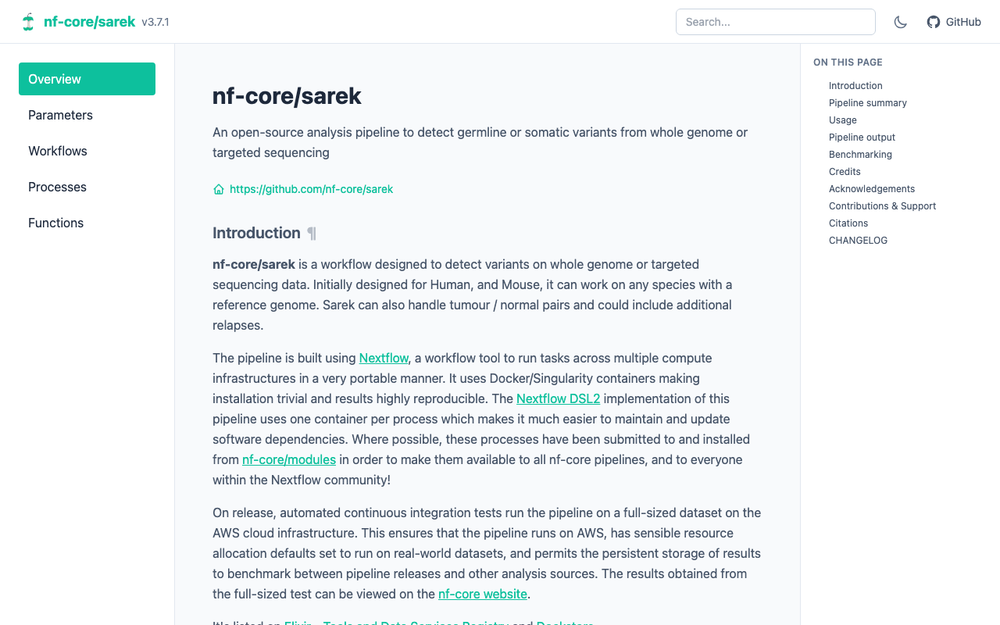

# nf-docs

Generate beautiful API documentation for Nextflow pipelines.

`nf-docs` extracts structured API documentation from Nextflow pipelines via the
[Nextflow Language Server](https://github.com/nextflow-io/language-server) — similar to Sphinx for
Python or Javadoc for Java.

!!! info

    This is not an official Nextflow project. It's a fun side-project by [Phil Ewels](https://github.com/ewels). Please use at your own risk :)

## Output formats

<!-- prettier-ignore-start -->

-   :material-language-html5:{ .lg .middle } __HTML__

    ---

    Single self-contained file with full-text search, deep linking, dark mode, source links, and mobile-friendly layout.

-   :material-language-markdown:{ .lg .middle } __Markdown__

    ---

    One file per section — integrates with static site generators like MkDocs or Zensical.

-   :material-code-json:{ .lg .middle } __JSON / YAML__

    ---

    Machine-readable structured data for CI/CD pipelines and custom integrations.

<!-- prettier-ignore-end -->
